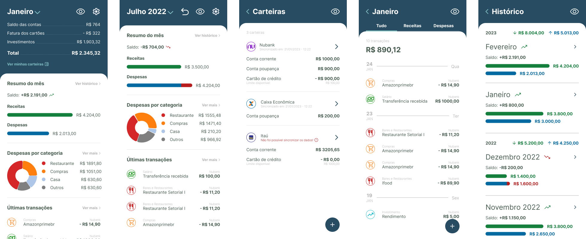

<h1 align="center">
  <div></img><div>
  Finans
</h1>

<p align="center">An Open Finance mobile app built using React Native and Expo.</p>

## About

📊 Finans - is a mobile app that lets you connect your bank accounts and view your financial data, such as your current aggregated balance and monthly transaction history, in one place. All this is possible thanks to [Open Finance](https://openfinancebrasil.org.br/) and the [pluggy.ai](https://pluggy.ai/) API, which provides a single interface for consuming data from different banking institutions.

## 🎨 Design

You can see the layout of this project in [Figma](https://www.figma.com/file/OMrKC7nSHrZgWkkyxPCTud/finance-app).

<h4 align="center">
  </img>
</h4>

## 🛠 Tools

- Expo
- React Native
- Typescript
- Styled Components

## 🚀 How to run it

```bash
# Clone this repository
$ git clone https://github.com/Joaomlg/finance-app

# Go to project path
$ cd finance-app

# Install dependences
$ npm install

# Server app
$ npm start
```
